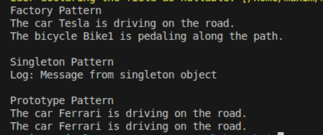

# Creational Design Patterns
## Author: Isacescu Maxim

---

## Objectives:
- Get familiar with the Creational Design Patterns;
- Choose a specific domain;
- Implement at least 3 Creational Design Patterns for the specific domain;

## Used Design Patterns:
- Factory Pattern - For creating vehicles without specifying exact classes
- Singleton Pattern - For ensuring only one instance of logger exists
- Prototype Pattern - For creating new vehicles by cloning existing prototypes

## Implementation

### Factory Pattern
Creates vehicles based on type without exposing instantiation logic.

```csharp
class VehicleFactory
{
    public IVehicle CreateVehicle(string type)
    {
        switch (type.ToLower())
        {
            case "car":
                return new Car();
            case "bicycle":
                return new Bicycle();
            default:
                throw new ArgumentException("Invalid vehicle type");
        }
    }
}
```

### Singleton Pattern
Ensures only one instance of VehicleLogger exists throughout the application.

```csharp
class VehicleLogger
{
    private static VehicleLogger _instance;
    
    public static VehicleLogger Instance
    {
        get
        {
            _instance ??= new VehicleLogger();
            return _instance;
        }
    }
    
    public void Log(string message)
    {
        Console.WriteLine($"Log: {message}");
    }
}
```

### Prototype Pattern
Creates new objects by cloning existing prototypes, avoiding expensive creation logic.

```csharp
interface IVehicle
{
    void Move();
    IVehicle Clone();
}

class Car : IVehicle
{
    public void Move()
    {
        Console.WriteLine("The car is driving on the road.");
    }
    
    public IVehicle Clone()
    {
        return new Car(); // Create new instance as clone
    }
}

class VehiclePrototype
{
    private IVehicle _carPrototype = new Car();
    private IVehicle _bikePrototype = new Bicycle();
    
    public IVehicle CreateCar() => _carPrototype.Clone();
    public IVehicle CreateBicycle() => _bikePrototype.Clone();
}

// Usage
VehiclePrototype prototype = new VehiclePrototype();
IVehicle clonedCar = prototype.CreateCar();
IVehicle clonedBike = prototype.CreateBicycle();
```

## Results
