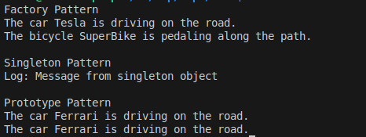

# Creational Design Patterns
## Author: Isacescu Maxim

---

## Objectives:
- Get familiar with the Creational Design Patterns;
- Choose a specific domain;
- Implement at least 3 Creational Design Patterns for the specific domain;

## Used Design Patterns:
- **Factory Pattern** - For creating vehicles using a registry-based approach that follows Open/Closed Principle
- **Singleton Pattern** - For ensuring only one instance of logger exists
- **Prototype Pattern** - For creating new vehicles by cloning existing prototypes

## Implementation

### Factory Pattern
Creates vehicles using a flexible registry system that allows easy extension without modifying existing code.

```csharp
class VehicleFactory
{
    private readonly Dictionary<string, Func<string, IVehicle>> _registry = new();

    public void RegisterVehicle(string type, Func<string, IVehicle> creator)
    {
        _registry[type.ToLower()] = creator;
    }

    public IVehicle CreateVehicle(string type, string name = "")
    {
        if (_registry.TryGetValue(type.ToLower(), out var creator))
            return creator(name);
        throw new ArgumentException($"Invalid vehicle type: {type}");
    }
}

// Usage
VehicleFactory factory = new VehicleFactory();
factory.RegisterVehicle("car", name => new Car(name));
factory.RegisterVehicle("bicycle", name => new Bicycle(name));

IVehicle car = factory.CreateVehicle("car", "Tesla");
IVehicle bicycle = factory.CreateVehicle("bicycle", "SuperBike");
```

### Singleton Pattern
Ensures only one instance of VehicleLogger exists throughout the application.

```csharp
class VehicleLogger
{
    private static VehicleLogger _instance;
    
    private VehicleLogger() { }
    
    public static VehicleLogger Instance
    {
        get
        {
            _instance ??= new VehicleLogger();
            return _instance;
        }
    }
    
    public void Log(string message)
    {
        Console.WriteLine($"Log: {message}");
    }
}

// Usage
VehicleLogger logger = VehicleLogger.Instance;
logger.Log("Message from singleton object");
```

### Prototype Pattern
Creates new objects by cloning existing prototypes, avoiding expensive creation logic. Each vehicle implements its own cloning logic.

```csharp
interface IVehiclePrototype
{
    IVehicle Clone();
}

class Car : IVehicle, IVehiclePrototype
{
    public string Name { get; set; }

    public Car() { }

    public Car(string name)
    {
        Name = name;
    }

    public void Move()
    {
        Console.WriteLine($"The car {Name} is driving on the road.");
    }
    
    public IVehicle Clone()
    {
        return new Car(this.Name);
    }
}

class Bicycle : IVehicle, IVehiclePrototype
{
    public string Name { get; set; }

    public Bicycle() { }

    public Bicycle(string name)
    {
        Name = name;
    }

    public void Move()
    {
        Console.WriteLine($"The bicycle {Name} is pedaling along the path.");
    }
    
    public IVehicle Clone()
    {
        return new Bicycle(this.Name);
    }
}

// Usage
Car originalCar = new Car("Ferrari");
IVehicle anotherCar = originalCar.Clone();
originalCar.Move();
anotherCar.Move();
```

## Results
