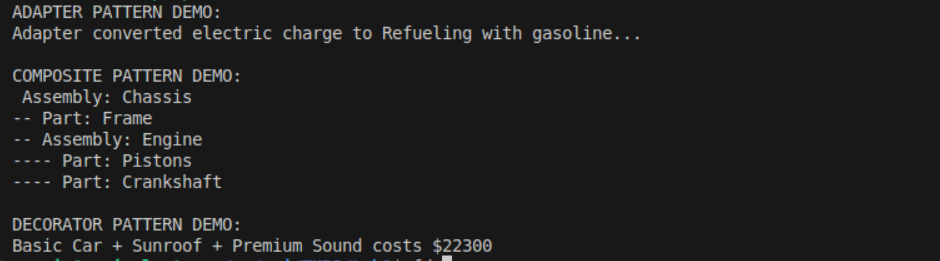

# Structural Design Patterns
## Author: Isacescu Maxim

## Objectives:

* Get familiar with the **Structural Design Patterns**
* Choose a specific **domain**
* Implement at least **three Structural Design Patterns** for that domain


## Used Design Patterns:

* **Adapter Pattern**
* **Composite Pattern**
* **Flyweight Pattern**


## Implementation

### Adapter Pattern

The **Adapter Pattern** allows incompatible interfaces to work together.
Here, `ElectricAdapter` adapts a **combustion engine** so it can be used where an **electric vehicle** is expected.

It translates a `Charge()` call into a `Refuel()` operation.

```csharp
public class ElectricAdapter : IElectricVehicle
{
    private readonly ICombustionEngine _combustionEngine;

    public ElectricAdapter(ICombustionEngine combustionEngine)
    {
        _combustionEngine = combustionEngine;
    }

    public void Charge()
    {
        Console.Write("Adapter converted electric charge to ");
        _combustionEngine.Refuel();
    }
}
```

### Composite Pattern

The **Composite Pattern** allows clients to treat individual components and compositions uniformly.

The `CarComponent` class can now contain **child components**, forming a **tree-like structure** (e.g., a “Door” can contain “Window” and “Hinge”).
The `Car` class itself acts as the composite root, holding multiple top-level components.

```csharp
public class CarComponent
{
    private readonly List<CarComponent> _children = new List<CarComponent>();
    public string Name { get; }
    public double Cost { get; }

    public void AddSubcomponent(string name, double cost)
    {
        var child = GetComponent(name, cost);
        _children.Add(child);
    }

    public void DisplayRecursive(int indent = 0)
    {
        var pad = new string(' ', indent * 2);
        Console.WriteLine($"{pad}- {Name} (${Cost})");
        foreach (var child in _children)
        {
            child.DisplayRecursive(indent + 1);
        }
    }

    public double GetTotalCostRecursive()
    {
        double total = Cost;
        foreach (var child in _children)
        {
            total += child.GetTotalCostRecursive();
        }
        return total;
    }
}
```

### Flyweight Pattern

The **Flyweight Pattern** minimizes memory usage by sharing common component instances across multiple cars.

Each `CarComponent` is retrieved via a static factory method that ensures **one shared instance per component name**.

```csharp
public static CarComponent GetComponent(string name, double cost)
{
    if (!_components.ContainsKey(name))
    {
        _components[name] = new CarComponent(name, cost);
    }
    return _components[name];
}
```

## Results


