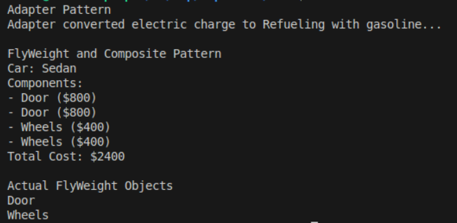

# Structural Design Patterns
## Author: Isacescu Maxim

---

## Objectives:
- Get familiar with the Structural DPs;
- Choose a specific domain;
- Implement at least 3 Structural DPs for the specific domain;

## Used Design Patterns:
- Adapter Pattern
- Composite Pattern
- Decorator Pattern

## Implementation

### Adapter Pattern
The Adapter pattern allows incompatible interfaces to work together. The ElectricAdapter converts the ICombustionEngine interface to work with IElectricVehicle.

```csharp
public class ElectricAdapter : IElectricVehicle
{
    private readonly ICombustionEngine _combustionEngine;

    public ElectricAdapter(ICombustionEngine combustionEngine)
    {
        _combustionEngine = combustionEngine;
    }

    public void Charge()
    {
        Console.Write("Adapter converted electric charge to ");
        _combustionEngine.Refuel();
    }
}
```

### Composite Pattern
The Composite pattern treats individual objects and compositions uniformly. VehicleAssembly can contain both VehicleParts and other VehicleAssemblies.  

```csharp
public class VehicleAssembly : VehicleComponent
{
    private readonly List<VehicleComponent> _children = new List<VehicleComponent>();
    
    public void Add(VehicleComponent component)
    {
        _children.Add(component);
    }

    public override void DisplayInfo(int depth = 0)
    {
        Console.WriteLine(new string('-', depth) + $" Assembly: {_name}");
        foreach (var component in _children)
        {
            component.DisplayInfo(depth + 2);
        }
    }

```
  

### Decorator Pattern
The Decorator pattern dynamically adds responsibilities to objects. VehicleDecorator allows adding features like sunroof and premium sound system to a basic vehicle.

```csharp
public class SunroofDecorator : VehicleDecorator
{
    public SunroofDecorator(Vehicle vehicle) : base(vehicle) { }

    public override string GetDescription()
    {
        return _vehicle.GetDescription() + " + Sunroof";
    }

    public override double GetCost()
    {
        return _vehicle.GetCost() + 1500;
    }
}
```
  

## Results
