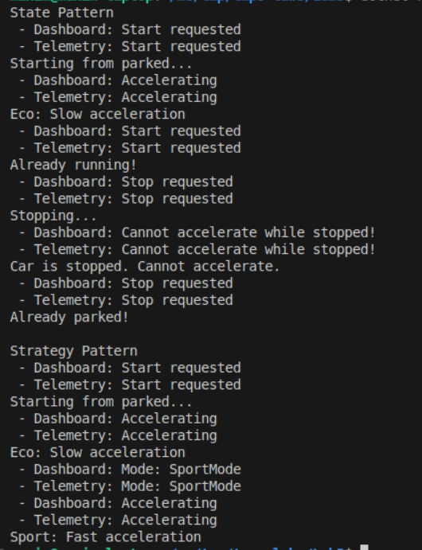

# Behavioral Design Patterns
## Author: Isacescu Maxim

----

## Objectives:
- Get familiar with the Behavioral DPs;
- Choose a specific domain;
- Implement at least 3 Behavioral DPs for the specific domain;

## Used Design Patterns: 
- Observer Pattern
- State Pattern
- Strategy Pattern

## Implementation

This project demonstrates three behavioral design patterns in the context of a vehicle system. The implementation shows how these patterns work together to create a flexible and maintainable car control system.

### Observer Pattern
The Observer pattern defines a one-to-many dependency between objects so that when one object changes state, all its dependents are notified automatically. The `Notifier` class manages observers (`IWatcher` implementations) that get notified of vehicle events.

```csharp
interface IWatcher
{
    void Notify(string message);
}

class Notifier
{
    private List<IWatcher> _watchers = new List<IWatcher>();
    
    public void AddWatcher(IWatcher watcher) => _watchers.Add(watcher);
    public void RemoveWatcher(IWatcher watcher) => _watchers.Remove(watcher);
    
    public void SendMessage(string message)
    {
        foreach (var watcher in _watchers)
            watcher.Notify(message);
    }
}

class Dashboard : IWatcher
{
    public void Notify(string message) => Console.WriteLine($"Dashboard: {message}");
}

class Telemetry : IWatcher
{
    public void Notify(string message) => Console.WriteLine($"Telemetry: {message}");
}
```

### State Pattern
The State pattern allows an object to alter its behavior when its internal state changes. The `Car` class uses `ICarState` implementations to manage different vehicle states (Parked and Running), ensuring proper state transitions.

```csharp
interface ICarState
{
    void Start(Car car);
    void Stop(Car car);
}

class ParkedState : ICarState
{
    public void Start(Car car)
    {
        Console.WriteLine("Starting from parked...");
        car.SetState(new RunningState());
    }
    
    public void Stop(Car car)
    {
        Console.WriteLine("Already parked!");
    }
}

class RunningState : ICarState
{
    public void Start(Car car)
    {
        Console.WriteLine("Already running!");
    }
    
    public void Stop(Car car)
    {
        Console.WriteLine("Stopping...");
        car.SetState(new ParkedState());
    }
}
```

### Strategy Pattern
The Strategy pattern defines a family of algorithms, encapsulates each one, and makes them interchangeable. `IDriveMode` allows different driving strategies (Eco and Sport modes) to be selected at runtime.

```csharp
interface IDriveMode
{
    void Accelerate();
}

class EcoMode : IDriveMode
{
    public void Accelerate() => Console.WriteLine("Eco: Slow acceleration");
}

class SportMode : IDriveMode
{
    public void Accelerate() => Console.WriteLine("Sport: Fast acceleration");
}
```

## Results
